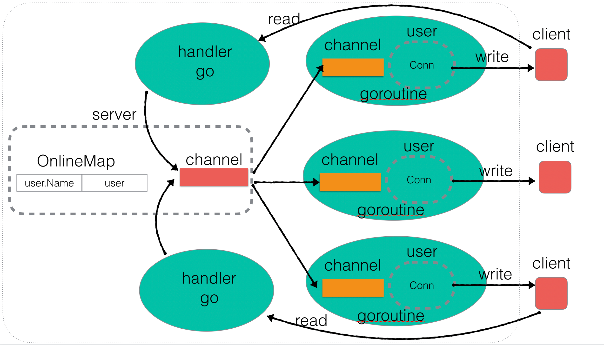

# Go 即时通讯系统

这是一个基于 Go 语言实现的简易即时通讯系统，包括服务器端和客户端。

## 功能特点

- 支持多个客户端连接。
- 支持公聊和私聊。
- 支持修改用户名。
- 服务器端具备用户上线、下线通知功能。
- 用户心跳检测，长时间未操作自动断开连接。

## 项目结构

```
.
├── README.md
├── client
│   ├── client.go
│   └── client.exe
├── server
│   ├── main.go
│   ├── server.go
│   ├── user.go
│   └── server.exe
├── .git
├── .gitignore
└── go.mod
```

## 如何运行

### 1. 构建可执行文件

在项目根目录下分别进入 `server` 和 `client` 目录，运行以下命令进行构建：

```bash
go build .
```

这将在各自目录下生成 `server.exe` 和 `client.exe` (在 Windows 系统下) 或 `server` 和 `client` (在类 Unix 系统下)。

### 2. 启动服务器

进入 `server` 目录，运行服务器可执行文件：

```bash
./server.exe  # 或者 ./server
```

服务器默认监听 `127.0.0.1:8888`。

### 3. 启动客户端

进入 `client` 目录，运行客户端可执行文件，并指定服务器 IP 和端口：

- 可以忽略 `-ip` 和 `-port` 参数，使用默认值，将指定默认IP 和端口为 `127.0.0.1:8888`

```bash
./client.exe -ip 127.0.0.1 -port 8888  # 或者 ./client -ip 127.0.0.1 -port 8888
```

连接成功后，客户端将显示操作菜单，您可以选择公聊、私聊或修改用户名。

## 使用说明

客户端连接成功后，您可以选择以下模式：

- **公聊模式**: 输入消息后按回车发送，所有在线用户都能收到。
- **私聊模式**: 输入 `to|用户名|消息内容` 的格式发送私聊消息。
- **更新名称**: 输入 `rename:新用户名` 的格式修改您的用户名。
- **查询在线用户**: 输入 `who` 查询当前在线用户列表。
- **退出聊天**: 输入 `0` 退出客户端。

## 系统设计

* 服务器端使用 `OnlineMap` 管理在线用户，使用读写锁保证并发安全。
* 服务器端使用一个全局的 `Message` 通道来接收所有用户的广播消息，并通过一个单独的 goroutine 将消息 fan-out 给所有在线用户。
* 每个客户端连接在服务器端都有一个对应的 `User` 对象和一个 goroutine 来处理其收发消息。
* 客户端通过菜单选择不同的操作模式。

## 架构图
